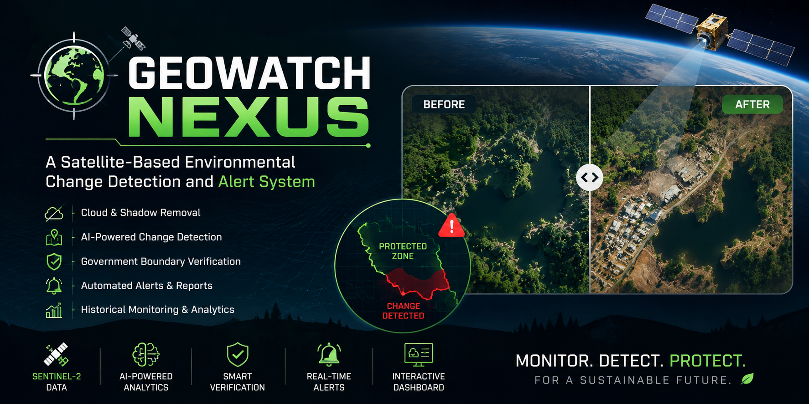

<div align="center">
  # GeoWatch Nexus
  **A Satellite-Based Environmental Change Detection and Alert System**

  [](https://reactjs.org/)
  [](https://vitejs.dev/)
  [](https://flask.palletsprojects.com/)
  [](https://www.python.org/)

  <br />

  
</div>

<br />

GeoWatch Nexus is a high-performance web application designed for satellite-based environmental monitoring. It allows researchers and analysts to define Areas of Interest (AOIs) anywhere on Earth, fetching satellite data to perform advanced change detection.

This repository contains both the **Flask Backend** (API) and the **Vite + React Frontend** (UI).

## 🌟 Key Features

* **Advanced AOI Selection**: Select monitoring regions using a fully interactive Leaflet map (Polygon & Rectangle drawing tools) or manual coordinate entry.
* **Premium Celestial Theme (v5)**: A state-of-the-art UI featuring a "Glassmorphism" aesthetic, complete with a beautifully animated Day/Night toggle that orchestrates a full-screen Sunset/Moonrise transition.
* **Dynamic Night Sky**: Dark mode features a procedurally animated twinkling star field and crescent moon for a deeply immersive satellite monitoring experience.
* **Robust Backend API**: Built with Python/Flask, structured with a scalable service-controller pattern for handling geocoding and geospatial data.

## 📁 Repository Structure

The project is structured as a monorepo containing two main directories:

* `/backend` - Python Flask API server.
* `/frontend` - React application built with Vite.

## 🚀 Getting Started

### Prerequisites

* **Node.js** (v18+ recommended)
* **Python** (v3.9+ recommended)

### 1. Setting up the Backend

1. Navigate to the backend directory:
   ```bash
   cd backend
   ```
2. Create and activate a virtual environment (optional but recommended):
   ```bash
   python -m venv venv
   source venv/bin/activate  # On Windows use: venv\Scripts\activate
   ```
3. Install the Python dependencies:
   ```bash
   pip install -r requirements.txt
   ```
4. Create a `.env` file in the `backend` directory (ensure this is ignored in git) and add your environment variables:
   ```env
   CORS_ORIGINS=http://localhost:5173
   # Add any third-party API keys here if required (e.g., geocoding providers)
   ```
5. Start the Flask development server:
   ```bash
   python app.py
   ```
   *The server will run on http://localhost:5000*

### 2. Setting up the Frontend

1. Open a new terminal and navigate to the frontend directory:
   ```bash
   cd frontend
   ```
2. Install the Node dependencies:
   ```bash
   npm install
   ```
3. Create a `.env` file in the `frontend` directory and define the backend API URL:
   ```env
   VITE_API_BASE_URL=http://localhost:5000/api
   ```
4. Start the Vite development server:
   ```bash
   npm run dev
   ```
   *The app will run on http://localhost:5173*

## 🎨 UI/UX Design System

GeoWatch Nexus utilizes a highly customized vanilla CSS design system (`index.css`) rather than a heavy utility framework like Tailwind. This allows for precise micro-interactions and high-performance CSS animations:

* **Glassmorphism Panels**: Semi-transparent frosted glass effects over the map.
* **Celestial Toggle**: A custom sun/moon toggle switch featuring internal craters, rays, and mini-stars.
* **Graceful Degradation**: Smooth fallback loaders instead of blocking skeletons for map tiles.

## 📝 Git Workflow Notes

* Ensure you do not commit your `.env` files. Both `frontend/.gitignore` and `backend/.gitignore` are configured to ignore them.
* The `requirements.txt` is up-to-date and tracks all necessary backend packages (`flask`, `flask-cors`, `python-dotenv`).

---
<div align="center">
  <em>Built with ❤️ for Environmental Monitoring.</em>
</div>
